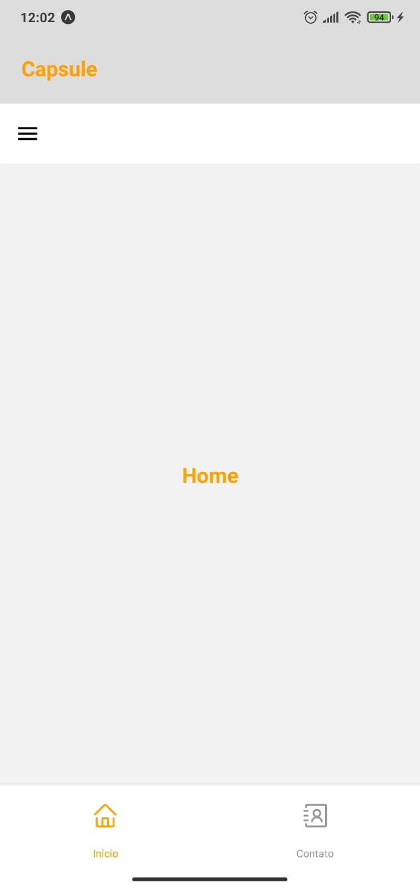
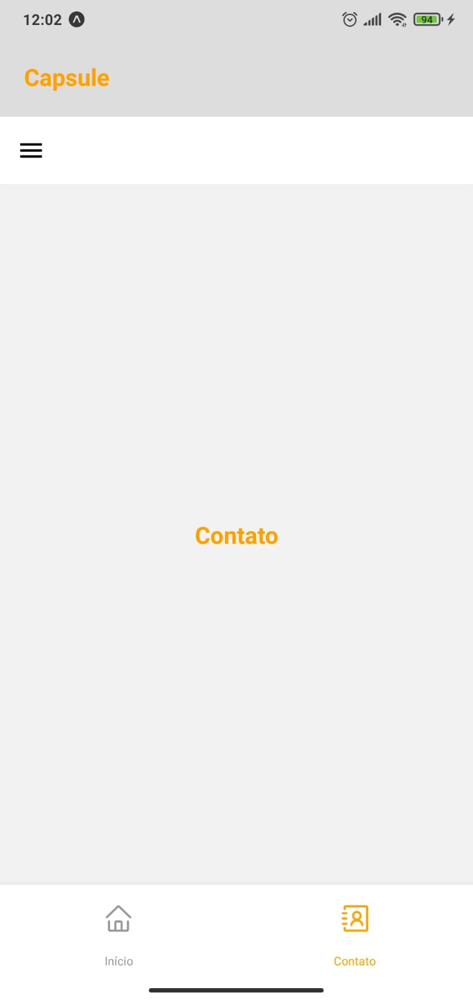
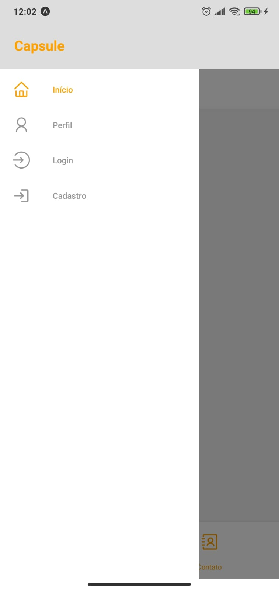
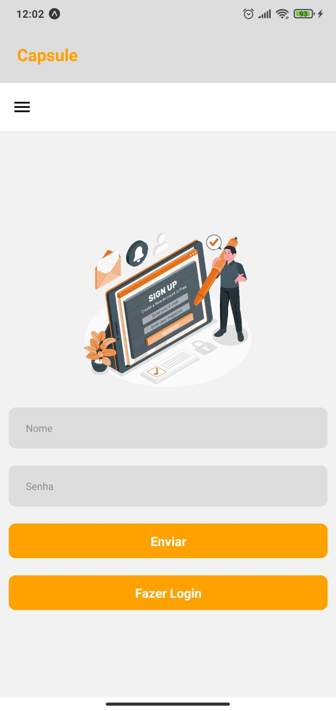
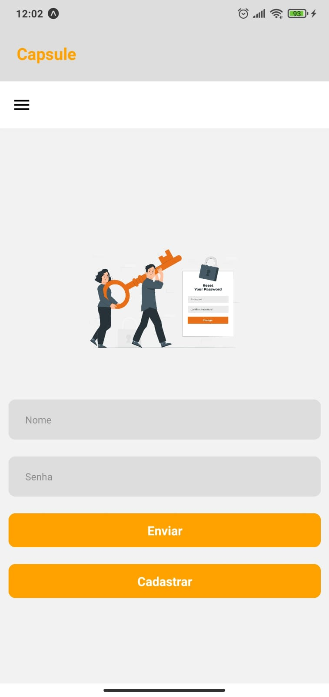

</h1>
   
<h1>React Navigation</h1> 

## Descrição

### Primeiros passos no [React Native](https://reactnative.dev/), aplicando simples exemplos usando os três tipos de navagações em aninhamento, [Tab Navigation](https://reactnavigation.org/docs/tab-based-navigation), [Drawer Navigation](https://reactnavigation.org/docs/drawer-based-navigation), [Stack Navigation](https://reactnavigation.org/docs/hello-react-navigation).

## Layout mobile

## 🛠️ Tecnologias

💻 **Front-end**
- [React Native](https://reactnative.dev/)
- [Typescript](https://www.typescriptlang.org)

📚 **Bibliotecas**
- [Tab Navigation](https://reactnavigation.org/docs/tab-based-navigation)
- [Drawer Navigation](https://reactnavigation.org/docs/drawer-based-navigation)
- [Stack Navigation](https://reactnavigation.org/docs/hello-react-navigation)

🎨 **Estilização**
- [StyleSheet](https://reactnative.dev/docs/stylesheet)

🔋 **Versionamento**
- [Git](https://git-scm.com)

 

⚙️ **Configuranções e Instalações**

Clone do Projeto

    $ git clone https://github.com/renovatt/react-native-navigation.git

Instalando as dependências

    $ npm install

Iniciando o projeto

    $ npm run dev

 

**Como contribuir?**

- Você pode dar suporte me seguindo aqui no GitHub
- Dando uma estrela no projeto
- Criar uma conexão comigo no linkedin fazendo parte da minha networking e curtir o meu projeto.

 

**Autor**
[Wildemberg Renovato de Lima](https://www.linkedin.com/in/renovatt/)